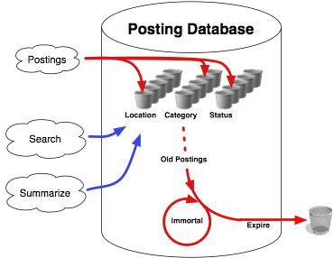
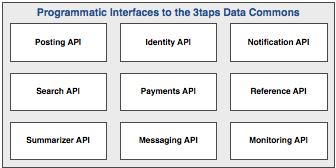

    <h1>
        The 3taps Data Commons
    </h1>

This document describes the 3taps Data Commons, what it attempts to achieve,
the technical details of how to use it, and how the Data Commons will be
developed over time.

### Overview ###

The 3taps Data Commons is a collection of software services built around the
notion of a __posting__.  A posting is a piece of data that represents the
availability or need for an exchange of goods or services.  For example, a
posting could represent an auction on eBay, a tweet on Twitter, a job listing
on Monster.com, or a classified advertisement on Craigslist.

Postings come in from various sources; users may create their postings directly
within 3taps, or an external "grabber" program may collect postings and forward
them to the 3taps posting API, either individually or _en masse_.

As postings come into the 3taps system, they are grouped according to
__location__, __category__ and __status__.  You can then __search__ for and
__summarize__ postings in various ways: by location, by status, by keyword,
etc.  By default, postings __expire__ after two weeks, at which time they are
removed from the system.  Certain postings, however, become __"immortal"__ and
remain in the database forever.

All of this can be visualised in the following way:

> 

As well as the postings themselves (and the posting, search and summarizer APIs
that go with them), the 3taps Data Commons includes several additional related
concepts:

 * The notion of __identity__ -- identifying an individual or organisation for
   the purpose of ownership or responsibility.  For example, who owns a
   particular posting, who wrote a message, or who to make a particular payment
   to.

 * The ability to __notify__ third parties as certain events occur.

 * The ability to make and receive __payments__, possibly related to a posting.

 * The ability to send __messages__ between two people.  Once again, these
   messages can optionally be related to a posting.

 * The ability to obtain __reference__ information about the available
   categories, locations, data sources, etc. 

Finally, the 3taps Data Commons includes __monitoring tools__ and processes to
ensure the ongoing performance and reliability of its internal systems.

All of these various parts of the 3taps Data Commons are made available through
the following interfaces:

> 

Before examining these various interfaces in detail, let's take a look at the
overall process used to develop the Data Commons, and how instrumentation,
performance and reliability reporting will be critical to its success.

### Development Road Map ###

The 3taps Data Commons is intended to be a living, constantly-evolving system.
The first release of the Data Commons will have just the bare minimum of
features, and updated versions of the system will be deployed regularly as new
features become available.

To allow for this, the 3taps Data Commons supports the concept of a __version
number__.  Every feature described in this document lists a minimum version
number: this is the version of the 3taps Data Commons where this feature will
become available.  Some features will evolve over time, and as new variants of
a feature (for example, new parameters or behaviour for an existing API call)
are designed, they will also be given a version number so that users of the
3taps Data Commons know exactly which how a particular feature will work for a
particular version of the system.

Version numbers will start at `v1`, and will be incremented by a one for each
new release of the Data Commons.  Thus, we will have versions `v1`, `v6`, `v9`,
`v10`, etc.

> > -------------------------------------------------------------------------
> > 
> > While the `v` is technically not required, it avoids confusion when
> > embedding a version number within a URL.
> > 
> > -------------------------------------------------------------------------

As well as numeric version numbers, the special string `latest` can be used to
automatically access the most recent version of the Data Commons.  So, for
example, the most recent version of the `posting/get` API call can be accessed
using the following URL:

>     http://3taps.com/api/latest/posting/get

While the API calls, and the admin interface, are all carefully distinguished
by version number, the various versions of the APIs will all access the same
underlying database.  Thus, for example, a call to:

>     http://3taps.com/api/v1/search

with a given set of search parameters will return the same set of postings as a
call to:

>     http://3taps.com/api/v2/search

with those same parameters (assuming, of course, that both versions support the
supplied parameters).

### Instrumentation, Performance and Reliability ###

tbd.

### Technical Documentation ###

The main way to access the 3taps Data Commons is through an API.

Note that all our APIs are versioned: you must include the version number in
the URL you use to access the API.  For example, to access the `/get` method of
the Posting API, you would use a URL that looks like this:

>     http://3taps.com/api/v1/posting/get

where `v1` is the version number of the API that you are accessing.

Detailed techical documentation for these various APIs can be found below:

> [__The Posting API__] (posting_api.md)    
> [__The Search API__] (search_api.md)    
> [__The Summarizer API__] (summarizer_api.md)    
> [__The Identity API__] (identity_api.md)    
> [__The Location API__] (location_api.md)    
> [__The Notification API__] (notification_api.md)    
> [__The Reference API__] (reference_api.md)    
> [__The Payments API__] (payments_api.md)    
> [__The Messaging API__] (messaging_api.md)    
> [__The Monitoring API__] (monitoring_api.md)

### The Admin Interface ###

tbd.

