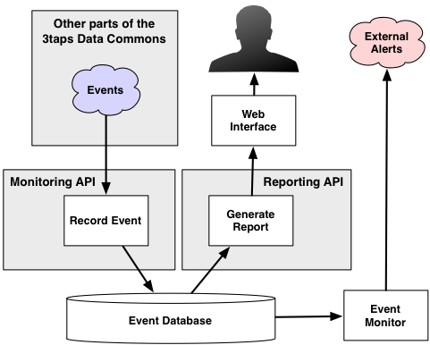

    <h1>
        The 3taps Data Commons
    </h1>
    <h3>
        The Monitoring API
    </h3>
    <h4>
        Specification Version 0.1
    </h4>

The 3taps Monitoring API is the "programmatic" interface to the 3taps
monitoring system.  It allows various parts of the system to record various
"events" that occur -- for example, postings coming in, search requests being
made, etc.  These events are stored in the event database, and can be used to
generate reports upon request.  The events also act as a "heartbeat",
indicating that certain parts of the system are still up and running; if a
given type of event stops being received, the monitoring system will send out
an alert.

The following illustration gives an overview of the 3taps Monitoring API and
how it fits into the overall event monitoring system:

> 

### The Anatomy of an Event ###

Every event has the following information associated with it:

 * A `timestamp`.  This is the date and time at which the event was logged by
   the 3taps Monitoring API.

 * A `source`.  This is a string identifying the part of the 3taps system
   which generated this event.

 * A `type`.  This is a string indicating the type of event which occurred.

 * A `primary_value`.  This is an integer, the meaning of which depends on the
   type of event.  For example, it might be the number of postings which were
   received, or the number of milliseconds it took to process a request.  Not
   all event types have a primary value associated with them.

 * A `secondary_value`.  This is an integer, the meaning of which depends on
   the type of event.  For example, it might be the number of milliseconds it
   took to process a batch of postings.  Not all event types have a secondary
   value associated with them.

 * An optional `text` value.

#### Event Sources ####

The following event sources are currently supported by the 3taps Data Commons:

> __POSTING_API__
> 
> > Indicates that this event was generated by the 3taps Posting API.
> 
> __SEARCH_API__
> 
> > Indicates that this event was generated by the 3taps Search API.
> 
> __SUMMARIZER_API__
> 
> > Indicates that this event was generated by the 3taps Summarizer API.

More event sources will be added as they are required.

#### Event Types ####

The following event types are currently supported:

> __POSTINGS_QUEUED__
> 
> > Indicates that a number of postings have been added to the posting queue.
> > For this type of event, the `primary_value` is the number of postings which
> > were added, and the `secondary_value` is the "wait\_for" value returned
> > back to the grabber.
> 
> __POSTINGS_DEQUEUED__
> 
> > Indicates that a number of postings have been removed from the posting
> > queue.  For this type of event, the `primary_value` is the number of
> > postings which were removed, and the `secondary_value` is ignored.
> 
> __POSTINGS_PROCESSED__
> 
> > Indicates that a number of postings have been geolocated, added to the
> > database, and notifications sent out.  For this type of event, the
> > `primary_value` is the number of postings which were processed, and the
> > `secondary_value` is the amount of time it took to process these postings,
> > in milliseconds.
> 
> __SEARCH_REQUESTS__
> 
> > Indicates that one or more search requests were made.  For this type of
> > event, the `primary_value` is the number of search requests, and the
> > `secondary_value` is the amount of time it took to process these requests,
> > in milliseconds.  Note that it is up to the Search API to choose whether to
> > generate one of these events for each search request, or to batch them up
> > and send them periodically.  If it processes each search request
> > individually (ie, `primary_value = 1`), it can optionally store the text of
> > the SQL query into the event's `text` field.  This can be used for
> > reporting if desired.
> 
> __SUMMARY_REQUESTS__
> 
> > Indicates that one or more summary requests were made.  For this type of
> > event, the `primary_value` is the number of summary requests, and the
> > `secondary_value` is the amount of time it took to process these requests,
> > in milliseconds.  Note that it is up to the Summary API to choose whether
> > to generate one of these events for each summary request, or to batch them
> > up and send them periodically.
> 
> __QUERY_TIMED_OUT__
> 
> > Indicates that an SQL query timed out in the database.  For this type of
> > event, the `primary_value` and `secondary_value` are both ignored, and the
> > `text` value will be set to the SQL query which timed out.

More event types will be added as they are required.

### Accessing the 3taps Monitoring API ###

The Monitoring API is accessed via the following URL:

>     http://3taps.com/api/xxx/monitoring

where `xxx` is the version number of the Monitoring API that you wish to
access, or the special string `latest` to automatically access the most recent
version of the API.

### Recording Events ###

To record an event, make an HTTP `POST` request to the main entry point for the
Monitoring API, as described above, with `/record` appended to the end of the
URL.  For example:

>     http://3taps.com/api/latest/monitoring/record

The following should be included, typically as URL-encoded parameters:

> `auth_token`
> 
> > This will eventually be the authentication token used to authenticate the
> > caller.  Note that this is currently ignored.
> 
> `source`
> 
> > A string indicating the source of this event.  See above for details.
> 
> `type`
> 
> > A string indicating the type of event.  See above for details.
> 
> `primary_value`
> 
> > An integer giving the primary value for this event, if any.
> 
> `secondary_value`
> 
> > An integer giving the secondary value for this event, if any.
> 
> `text`
> 
> > The text to associate with this event, if any.

Upon completion, the Monitoring API will send back a response with a
Content-Type of `text/plain`, and the body of the response will either be the
string __OK__, indicating that the event was accepted, or a string describing
what was wrong with the request.  Note that requests are typically only
rejected if the `source` or `type` was invalid, or some required fields were
missing.

### Monitoring for Alerts ###

tbd.

