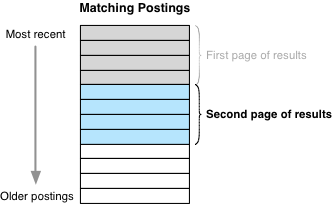
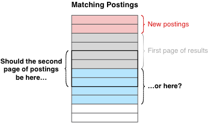
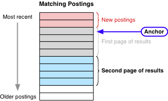

    <h1>
        The 3taps Data Commons
    </h1>
    <h3>
        The Search API
    </h3>
    <h4>
        Specification Version 0.3
    </h4>

The 3taps Search API is responsible for searching against the database of
postings.  For example, it can be used to find all postings from a particular
data source, category and location, or to find postings with a given annotation
value.  

A search request is made to the 3taps Search API, and search results are
returned back to the caller.  The search request can include any number of
__search criteria__, and the results will be __paginated__ to keep the search
process manageable.

Let's take a closer look at these two concepts.

### Search Criteria ###

A search request can include the following search criteria:

> `category_group`
> 
> > The desired 3taps category grouping code.  Only postings with the given
> > category group will be included in the search results.
> 
> `category`
> 
> > The desired 3taps category code.  Only postings with the given category
> > code will be included in the search results.
> 
> `country`
> 
> > The desired 3taps country code.  Only postings with the given country code
> > will be included in the search results.
> 
> `state`
> 
> > The desired 3taps state.  Only postings with the given state code will be
> > included in the search results.
> 
> `metro`
> 
> > The desired 3taps metro area code.  Only postings with the given metro area
> > code will be included in the search results.
> 
> `region`
> 
> > The desired 3taps region code.  Only postings with the given region code
> > will be included in the search results.
> 
> `county`
> 
> > The desired 3taps county code.  Only postings with the given county code
> > will be included in the search results.
> 
> `city`
> 
> > The desired 3taps city code.  Only postings with the given city code will
> > be included in the search results.
> 
> `locality`
> 
> > The desired 3taps locality code.  Only postings with the given locality
> > code will be included in the search results.
> 
> `zipcode`
> 
> > The desired 3taps ZIP code.  Only postings with the given ZIP code will be
> > included in the search results.
> 
> `source`
> 
> > The desired 3taps source code.  Only postings with the given source code
> > will be included in the search results.
> 
> `heading`
> 
> > A freeform text string.  Only postings with the given string in their
> > heading wil be included in the search results.
> 
> `body`
> 
> > A freeform text string.  Only postings with the given string in their body
> > will be included in the search results.
> 
> `text`
> 
> > A freeform text string.  Only postings with the given string in their
> > heading or body will be included in the search results.
> 
> `timestamp`
> 
> > This parameter is used to only include postings with a given range of
> > timestamp values.  The parameter's value should be a string of the form:
> > 
> > >     MIN_TIMESTAMP..MAX_TIMESTAMP
> > 
> > where `MIN_TIMESTAMP` and `MAX_TIMESTAMP` represent the minimum and maximum
> > timestamp values, respectively.  Both timestamps should be an integer
> > number of seconds since the 1st of January 1970 ("unix time"), in UTC.
> 
> `id`
> 
> > This parameter can be used to search for a single posting with a single
> > record ID, or a number of postings within a given range of record IDs.  To
> > search against a single record ID, the value should simply be the integer
> > record ID, like this:
> > 
> > >     ?id=1234567
> > 
> > Alternatively, to search against a range of record IDs, the parameter
> > should look like this:
> > 
> > >     ?id=1234567..1234890
> 
> `price`
> 
> > This parameter is used to only include postings with a given range of price
> > values.  The parameter's value should be a string formatted in one of the
> > following ways:
> > 
> > >     MIN_PRICE..MAX_PRICE
> > >     MIN_PRICE..
> > >     ..MAX_PRICE
> > 
> > `MIN_PRICE` and `MAX_PRICE` represent the minimum and maximum price values.
> > If both are supplied, then only postings with the given range of price
> > values will be included in the search results.  If only a minimum price is
> > supplied, only postings greater than or equal to that minimum price will be
> > included.  Similarly, if only a maximum price is supplied, only postings
> > less than or equal to that maximum price will be included.
> > 
> > Note that price values can be given as either integer or floating-point
> > values.
> 
> `currency`
> 
> > Only include postings in the given currency.  The parameter's value should
> > be a 3-character ISO-4217 currency code.
> 
> `annotations`
> 
> > A specially-formatted string identifying one or more annotation values.
> > Only postings which match the given annotation value(s) will be included in
> > the search results.
> > 
> > The value of this parameter should consist of one or more `key:value` pairs
> > separated by either `AND` or `OR`, and the whole string surrounded by `{`
> > and `}` characters.  For example:
> > 
> > >     annotations={make:ford AND model:mustang}
> 
> `status`
> 
> > Only include postings with the given status value.  The following status
> > values are currently supported:
> > 
> > >     offered
> > >     wanted
> > >     lost
> > >     stolen
> > >     found
> > >     deleted
> 
> `has_image`
> 
> > If this parameter is supplied and has the value "1", only postings which
> > have an image will be included in the search results.  If this parameter
> > has the value "0", only postings which do not have images will be included
> > in the search results.
> 
> `include_deleted`
> 
> > By default, deleted postings will not be included in the search results.
> > If this parameter is supplied and has the value "1", however, deleted
> > postings will be included in the search results.
> 
> `only_deleted`
> 
> > If this parameter is supplied and has the value "1", only deleted postings
> > will be included in the search results.

### Pagination of Search Results ###

A search request will often find too many postings to return all at once.  For
example, imagine a search for the word "the" in a posting database consisting
of 17 million postings.  This search may well return 12 million postings --
there is no way the Search API could read all those postings from the database,
bundle them up and return them back to the caller all at once.  Such a request
would take several minutes at least, and the client would probably choke on the
huge packet of data that was returned.

To avoid this, the search API makes use of pagination -- that is, an initial
search will return the first page of search results, which would typically be
the "N" most recent matching postings:

> 

To retrieve more postings, the caller makes another call to the Search API,
asking for the second page of results:

> 

More calls can be made to retrieve more postings, going further and further
back through the posting database.

There is, however, a problem with this pagination model: the posting database
is not static.  New postings are being added all the time, pushing the existing
postings further back in time.  What this means for the Search API is
ambiguous -- how should the Search API interpret the concept of the "second page
of search results" when new postings have been added to the database?

> 

Previous implementations of the Search API ignored this issue, simply returning
the second page of the search results even if new postings have been received
since the first search query was made.  This meant that calling the Search API
several times to get multiple pages of results often returned duplicate copies
of some postings.

To avoid this issue, the Search API now returns an __anchor__ along with
the search results themselves:

> 

This anchor is used to keep the pages of search results in the same place in
the posting database, even as new postings come in.  The anchor is also used to
tell the caller that more postings have been added to the database since the
initial search was made.

### Calling the 3taps Search API ###

The Search API is accessed via a single entry point, which can be found at the
following URL:

>     http://api.3taps.com/xxx/search

where `xxx` is the version number of the Search API that you wish to access, or
the special string `latest` to automatically access the most recent version of
the API.

The Search API call is made using an HTTP `GET` request to the above URL.  To
make a search request, pass the following parameters in addition to the search
criteria themselves:

> `auth_token`
> 
> > This will eventually be the authentication token used to authenticate the
> > caller.  Note that this is currently ignored.
> 
> `rpp`
> 
> > The desired number of results per page.  This defaults to 10, but can be
> > set to any value from 1 to 100.
> 
> `retvals`
> 
> > A string listing the fields which should be returned back to the caller.
> > The various fields should be separated by commas.  At present, the
> > following fields can be included in this parameter:
> > 
> > > __id__
> > > __account_id__   
> > > __source__   
> > > __category__   
> > > __category_group__   
> > > __location__   
> > > __external_id__   
> > > __external_url__   
> > > __heading__   
> > > __body__   
> > > __html__   
> > > __timestamp__   
> > > __expires__   
> > > __language__   
> > > __price__   
> > > __currency__   
> > > __images__   
> > > __annotations__   
> > > __status__   
> > > __immortal__   
> > 
> > If no `retvals` parameter is provided, the following default will be used:
> > 
> > > __id__
> > > __source__   
> > > __category__   
> > > __location__   
> > > __external_id__   
> > > __external_url__   
> > > __heading__   
> > > __timestamp__   

Upon completion, the Search API will send back a response with a Content-Type
of `application/json`, and the body of the response will be a JSON-formatted
object with the following fields:

> `success`
> 
> > A boolean indicating whether or not the search request succeeded.
> 
> `error`
> 
> > If the search request was not successfully processed, this will be a string
> > describing what went wrong.
> 
> `anchor`
> 
> > This will be a string that can be used in subsequent search requests to
> > ensure that the pagination is consistent even if new postings are received.
> > See above for details.
> 
> `postings`
> 
> > An array containing the found postings, in reverse timestamp order.  Each
> > entry in this array will be an object with all or some of the following
> > fields, depending on the value of the `retvals` parameter, above:
> > 
> > > `id`
> > > 
> > > > The internal record ID used to uniquely identify this posting.  Note
> > > > that this will be a (possibly very large) integer.
> > > 
> > > `account_id`
> > > 
> > > > A string identifying the user who submitted the posting.
> > > 
> > > `source`
> > > 
> > > > The code for the source system where this posting originated from.
> > > 
> > > `category`
> > > 
> > > > The 3taps category code for this posting.
> > > 
> > > `category_group`
> > > 
> > > > The 3taps category group code for this posting.
> > > 
> > > `location`
> > > 
> > > > An object with some or all of the following fields:
> > > > 
> > > > > `lat`
> > > > > 
> > > > > > The latitude of this posting, in decimal degrees.
> > > > > 
> > > > > `long`
> > > > > 
> > > > > > The longitude of this posting, in decimal degrees.
> > > > > 
> > > > > `accuracy`
> > > > > 
> > > > > > An integer indicating the accuracy of the supplied lat/long value.
> > > > > 
> > > > > `country`
> > > > > 
> > > > > > The 3taps country code for this posting.
> > > > > 
> > > > > `state`
> > > > > 
> > > > > > The 3taps state code for this posting.
> > > > > 
> > > > > `metro`
> > > > > 
> > > > > > The 3taps metro area code for this posting.
> > > > > 
> > > > > `region`
> > > > > 
> > > > > > The 3taps region code for this posting.
> > > > > 
> > > > > `county`
> > > > > 
> > > > > > The 3taps county code for this posting.
> > > > > 
> > > > > `city`
> > > > > 
> > > > > > The 3taps city code for this posting.
> > > > > 
> > > > > `locality`
> > > > > 
> > > > > > The 3taps locality code for this posting.
> > > > > 
> > > > > `zipcode`
> > > > > 
> > > > > > The 3taps ZIP code for this posting.
> > > 
> > > `external_id`
> > > 
> > > > A string that uniquely identifies the posting in the source system.
> > > 
> > > `external_url`
> > > 
> > > > A URL pointing to the original posting.
> > > 
> > > `heading`
> > > 
> > > > A string containing the heading for this posting.
> > > 
> > > `body`
> > > 
> > > > A string containing the body of this posting, in plain (unformatted)
> > > > text.
> > > 
> > > `html`
> > > 
> > > > The original HTML text for this posting, encoded using base64 character
> > > > encoding to avoid problems with JSON representation of HTML text.
> > > 
> > > `timestamp`
> > > 
> > > > The date and time at which the posting was created, as an integer
> > > > number of seconds since the 1st of January 1970 (“unix time”), in UTC.
> > > 
> > > `expires`
> > > 
> > > > The date and time at which this posting should expire, as an integer
> > > > number of seconds since the 1st of January 1970 (“unix time”), in UTC. 
> > > 
> > > `language`
> > > 
> > > > The 2-character ISO 639–1 language code indicating which language the
> > > > posting is in.
> > > 
> > > `price`
> > > 
> > > > The price associated with this posting, if any.
> > > 
> > > `currency`
> > > 
> > > > The 3-character ISO–4217 currency code indicating which currency the
> > > > price is in.
> > > 
> > > `images`
> > > 
> > > > An array of image objects representing the images associated with this
> > > > posting. Each image object can have the following fields:
> > > > 
> > > > > `full`
> > > > > 
> > > > > > The URL pointing to the full-sized image for this posting.
> > > > > 
> > > > > `full_width`
> > > > > 
> > > > > > The width, in pixels, for the full-sized image, if known.
> > > > > 
> > > > > `full_height`
> > > > > 
> > > > > > The height, in pixels, for the full-sized image, if known.
> > > > > 
> > > > > `thumbnail`
> > > > > 
> > > > > > The URL pointing to a thumbnail-sized image for this posting.
> > > > > 
> > > > > `thumbnail_width`
> > > > > 
> > > > > > The width, in pixels, for the thumbnail-sized image, if known.
> > > > > 
> > > > > `thumbnail_height`
> > > > > 
> > > > > > The height, in pixels, for the thumbnail-sized image, if known.
> > > 
> > > `annotations`
> > > 
> > > > A object holding the various annotations to associate with this
> > > > posting. Each field in this object maps the annotation name to its
> > > > associated value, formatted as a string.
> > > 
> > > `status`
> > > 
> > > > An object representing the posting’s status. This object will have the
> > > > following fields:
> > > > 
> > > > > `offered`
> > > > > 
> > > > > > __true__ if the posting is offered, __false__ otherwise.
> > > > > 
> > > > > `lost`
> > > > > 
> > > > > > __true__ if the posting is lost, __false__ otherwise.
> > > > > 
> > > > > `stolen`
> > > > > 
> > > > > > __true__ if the posting is stolen, __false__ otherwise.
> > > > > 
> > > > > `found`
> > > > > 
> > > > > > __true__ if the posting is found, __false__ otherwise.
> > > > > 
> > > > > `deleted`
> > > > > 
> > > > > > __true__ if the posting is deleted, __false__ otherwise.
> > > > > 
> > > 
> > > `immortal`
> > > 
> > > > __true__ if the posting is immortal (ie, never expires), __false__
> > > > otherwise.
> 
> `num_matches`
> 
> > The total number of matching postings found by this search.  Note that this
> > is the number of matching postings in the database, not the number of
> > postings actually returned in the current page of search results.

After making the initial search request, you can ask for more pages of results
by reissuing the search request with the following additional parameters:

> `anchor`
> 
> > The anchor value returned by the Search API when the first request was
> > made.
> 
> `page`
> 
> > The page number for the desired page of postings.  Note that the first page
> > of search results has a page number of zero, so to obtain the second page
> > of results you should use the value 1, and so on.

__WARNING:__ Make sure you also include the other parameters you passed when
making the original search request, in particular the search criteria and the
`rpp` value.  Changing these will result in the wrong set of postings being
returned.

The response will be the same as for the intial search request, with the
addition of one extra field in the returned JSON object:

> `new_postings`
> 
> > This is the number of new postings which have been added to the database
> > since the initial search request was made.

Note that if new postings have come in, you can find these postings by
reissuing the search request without the `anchor` parameter.

